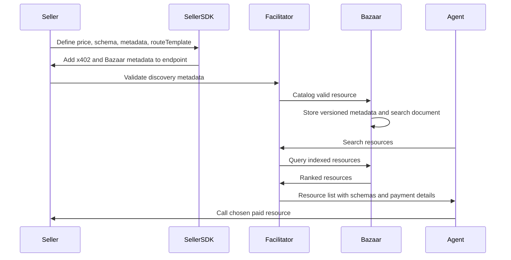

# Discovery Flow

LumenBazaar discovery lets buyers and AI agents find paid HTTP endpoints and MCP tools before making a paid request. The discovery layer is off-chain by default and stores versioned metadata, search documents, catalog events, and validation outcomes.

## Discovery Diagram



## Resource Types

The discovery index should represent:

- Paid HTTP APIs.
- Paid MCP tools.
- Data services.
- Model endpoints.
- Search and RAG endpoints.
- Future resource types that can describe price, route, schema, network, asset, and seller metadata.

## Seller Metadata

Seller metadata should include:

- Seller display name.
- Seller wallet address.
- Seller domain.
- Domain verification status.
- Resource name and description.
- Resource type.
- Endpoint URL.
- Route template.
- Input schema.
- Output schema.
- Network.
- Payment asset.
- Amount.
- `payTo` address.
- Extensions, including Bazaar and MCP metadata.

## Validation

Before cataloging, the backend must validate:

- Seller ownership or authorization.
- Seller domain verification when trusted catalog status is required.
- Endpoint URL shape.
- Route template safety.
- Network support.
- Asset support.
- Amount format.
- Recipient address.
- Input schema.
- Output schema.
- MCP metadata shape for MCP tools.
- Bazaar extension compatibility.

Invalid metadata should be rejected with stable reasons such as `CATALOG_VALIDATION_FAILED`, `ROUTE_TEMPLATE_INVALID`, or `SELLER_DOMAIN_UNVERIFIED`.

## Route Template Safety

Route templates are part of the trust boundary. They must not allow path traversal, ambiguous parameter expansion, or mismatches between URL parameters and declared schemas.

Examples:

```txt
/weather/{city}
/search/{index}/documents
/models/{modelId}/infer
```

The validator should reject malformed templates and should keep the exact validation reasons available to sellers and reviewers.

## Cataloging

Cataloging should:

- Persist the resource record.
- Persist a resource version.
- Persist schemas.
- Persist payment requirements.
- Write a catalog event.
- Queue search indexing.
- Report catalog outcome to the seller.

Catalog history matters because resource metadata can change over time. Receipts and old payment attempts should still be explainable using the version that was active when the payment happened.

## Search

Search should support:

- Natural language query.
- Network filter.
- Asset filter.
- Resource type filter.
- Seller filter.
- Price filter.
- Extension filter.
- Cursor or pagination.
- Relevance and quality ranking.

Ranking should consider:

- Text relevance.
- Metadata quality.
- Resource type.
- Network.
- Payment asset.
- Price.
- Seller verification.
- Historical uptime.
- Recent settlement success.
- Schema completeness.

## Partial Results

The API should return `partialResults` when ranking or indexing is incomplete. This is important for agents because it tells them not to assume the result set is complete.

Common causes include:

- Search index lag.
- Worker backlog.
- Temporarily unavailable ranking service.
- Newly cataloged resources that are stored but not indexed yet.

## Off-Chain Indexing

The discovery index stays off-chain by default. Stellar provides settlement evidence, while the discovery layer provides fast search, metadata filtering, and resource quality signals.

This design keeps discovery practical, but it means the backend must defend against catalog poisoning with domain verification, schema validation, route-template checks, audit logs, rate limits, and moderation or trust signals.

## API Surface

Discovery clients should use:

```txt
GET  /v1/discovery/resources
GET  /v1/discovery/search
POST /v1/discovery/validate
POST /v1/discovery/catalog
```

The frontend resource explorer, buyer SDK, and MCP server should all consume the same discovery behavior so resource search remains consistent across user interfaces and agent workflows.
