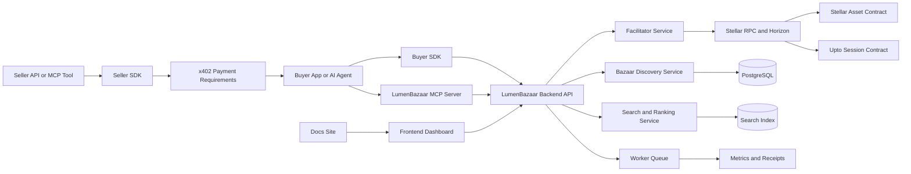

# Architecture Overview

LumenBazaar is an open-source, Stellar-native infrastructure system for paid APIs and MCP tools. It connects sellers, buyers, AI agents, operators, and reviewers through a four-repository architecture.

The system is built around an x402 payment handshake: a seller resource returns HTTP 402 payment requirements, the buyer authorizes payment, the facilitator verifies and settles the payment on Stellar, and a receipt is returned with settlement evidence.

## System Diagram

## Core Components

| Component | Responsibility | Repository |
| --- | --- | --- |
| Seller SDK | Builds x402 payment requirements, Bazaar metadata, route templates, and middleware. | `lumenbazaar-backend` |
| Buyer SDK | Searches resources, prepares payment payloads, verifies, retries, settles, fetches receipts, and enforces local budget limits. | `lumenbazaar-backend` |
| Backend API | Hosts facilitator, discovery, resource, seller, payment, receipt, and conformance endpoints. | `lumenbazaar-backend` |
| Worker | Confirms settlements, indexes resources, syncs search, runs conformance checks, finalizes receipts, and cleans stale payments. | `lumenbazaar-backend` |
| MCP Server | Exposes deterministic tools for paid resource search, inspection, payment preparation, paid calls, receipts, budgets, and supported networks. | `lumenbazaar-backend` |
| Contracts | Enforce capped metered `upto` sessions and demonstrate smart account payment policies. | `lumenbazaar-contracts` |
| Frontend | Provides dashboards for discovery, seller onboarding, payment playground, transactions, operators, and conformance. | `lumenbazaar-frontend` |
| Docs | Explains architecture, guides, references, security, operations, funding, and contributor workflows. | `lumenbazaar-docs` |

## Request Lifecycle

1. A seller protects an API or MCP tool with seller SDK middleware.
2. The resource returns HTTP 402 payment requirements when payment is needed.
3. A buyer app, wallet, automation service, or AI agent inspects the terms.
4. The buyer authorizes a Stellar payment payload.
5. The facilitator verifies network, asset, amount, recipient, expiry, and authorization.
6. The buyer retries the original request with the payment payload.
7. The seller asks the facilitator to settle the payment.
8. The facilitator submits settlement to Stellar and records a receipt.
9. The resource response is returned with payment evidence.
10. Discovery and metrics systems update public resource and settlement state where appropriate.

## Boundaries

Exact x402 payments and capped `upto` sessions are separate flows. Exact payments use Stellar payment authorization and settlement without a custom LumenBazaar contract when possible. `Upto` sessions use Soroban contract enforcement only when a resource needs metered billing up to a buyer-approved cap.

The discovery index is off-chain by default. This keeps search fast and practical while preserving settlement evidence on Stellar. The index must still validate seller metadata, route templates, schemas, assets, recipients, and domain ownership before resources are treated as trusted.

The facilitator is non-custodial. It verifies and settles authorized payment payloads, but it must never store private keys or act as the source of buyer funds.

## Repository Ownership

The repositories are intentionally separate:

- Frontend owns user experience.
- Backend owns API, payments, discovery, SDKs, MCP, workers, metrics, and conformance.
- Contracts owns on-chain enforcement and generated bindings.
- Docs owns public explanation and generated reference publishing.

For more detail, see [Repository Map](/architecture/repository-map).
