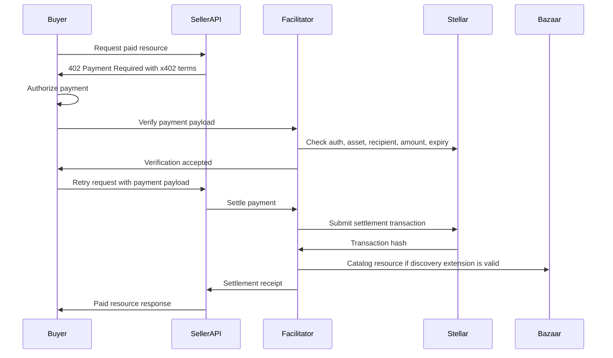

# Payment Flow

LumenBazaar uses the x402 payment pattern for machine-readable paid resources. A seller resource returns HTTP 402 payment requirements, a buyer authorizes payment, the facilitator verifies the payment payload, and the seller settles before returning the paid response.

## Exact Payment Flow



## Step 1: Initial Request

The buyer calls a seller-owned HTTP endpoint or MCP tool without a valid payment payload.

The seller resource should respond with HTTP 402 and x402 payment requirements that include:

- Scheme.
- Network.
- Asset.
- Amount.
- Recipient.
- Expiry.
- Resource metadata.
- Optional Bazaar discovery extension.

## Step 2: Buyer Authorization

The buyer inspects the payment requirements and authorizes a payment payload. Authorization may come from a wallet, smart account, or controlled automation environment.

The buyer should verify local policy before signing:

- The network is expected.
- The asset is supported.
- The amount is within budget.
- The recipient matches the intended seller.
- The authorization expires within an acceptable window.

## Step 3: Facilitator Verification

The buyer sends the payment payload to:

```txt
POST /v1/verify
```

The facilitator validates:

- `stellar:testnet` or `stellar:pubnet` support.
- SEP-41 asset configuration.
- Exact amount.
- Exact recipient.
- Expected network.
- Authorization validity.
- Ledger expiry.
- Replay protection.

Verification must return a machine-readable result. A failed verification must include a stable error code such as `UNSUPPORTED_NETWORK`, `UNSUPPORTED_ASSET`, `AUTH_EXPIRED`, `AMOUNT_MISMATCH`, `ASSET_MISMATCH`, `RECIPIENT_MISMATCH`, or `REPLAY_DETECTED`.

## Step 4: Paid Retry

After successful verification, the buyer retries the original resource request with the payment payload attached according to the x402 client behavior.

The seller resource should not serve the paid response until settlement succeeds or until the seller has intentionally accepted a documented delayed-settlement risk.

## Step 5: Settlement

The seller resource asks the facilitator to settle through:

```txt
POST /v1/settle
```

The facilitator submits the settlement transaction through Stellar tooling and records:

- Payment attempt.
- Settlement status.
- Transaction hash.
- Ledger number.
- Asset.
- Amount.
- Seller.
- Resource.
- Failure reason when settlement fails.

## Step 6: Receipt

A successful settlement produces a receipt. The receipt is the durable payment evidence for buyers, sellers, operators, and reviewers.

Receipts should include:

- Receipt ID.
- Resource ID.
- Seller ID.
- Payment attempt ID.
- Settlement status.
- Network.
- Asset code and issuer.
- Amount.
- Transaction hash when settled.
- Ledger when confirmed.
- Machine-readable failure code when failed.

Screenshots are not conformance proof. Transaction hashes, conformance outputs, receipts, and reproducible tests are the evidence that matters.

## Future Upto Sessions

Exact payments and `upto` sessions are separate flows.

Use exact payments for fixed-price resources where the seller knows the amount before the buyer authorizes payment. Use `upto` sessions for metered resources where the final usage is known only after execution, such as token-billed inference, result-count billing, byte billing, or long-running agent tasks.

The `upto` flow requires the `upto-session` Soroban contract to enforce:

- Buyer-approved maximum spend.
- Fixed seller.
- Fixed asset.
- Expiry.
- Single settlement.
- Usage receipt hash.
- Rejection of settlement above the cap.

The backend should expose `upto` behavior behind explicit support flags and separate validation paths so exact payment semantics stay simple.

## Failure Handling

All payment failures should be machine-readable. Human-readable messages are useful, but clients and agents need stable codes to decide whether to retry, reauthorize, switch resources, or stop.

Common failures include:

- Unsupported network or asset.
- Invalid payment payload.
- Invalid signature.
- Expired authorization.
- Replay detection.
- Amount, asset, or recipient mismatch.
- Settlement failure.
- Missing trustline.
- Rate limiting.
- Internal service failure.
