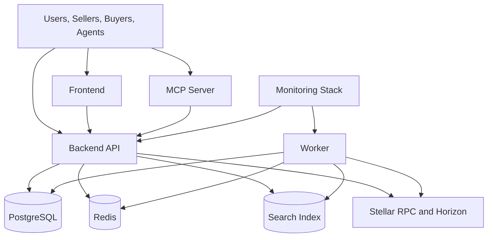

# Self-Hosting

LumenBazaar is designed to be self-hostable. Operators can run their own facilitator, discovery index, MCP server, workers, frontend, and docs rather than depending on one hosted operator.

## Service Topology



## Required Services

A complete deployment includes:

- PostgreSQL.
- Redis.
- Search index.
- Backend API.
- Worker.
- MCP server.
- Frontend.
- Docs site.
- Monitoring stack.

## Local Development

Local development should use Docker Compose for infrastructure services:

```txt
postgres
redis
search
```

Then run application services from their repositories:

```txt
lumenbazaar-backend/apps/api
lumenbazaar-backend/apps/worker
lumenbazaar-backend/apps/mcp-server
lumenbazaar-frontend
lumenbazaar-docs
```

The exact Compose file belongs in the backend repo because the backend owns database, Redis, search, workers, and API services.

## Production Deployment Options

Suggested hosting options:

| Component | Options |
| --- | --- |
| Frontend | Vercel, Netlify, Cloudflare Pages |
| Backend API | Fly.io, Render, Railway, AWS, GCP |
| Database | Managed PostgreSQL |
| Redis | Managed Redis |
| Search | Managed Meilisearch, Typesense, or self-hosted search |
| Docs | Vercel, Netlify, GitBook, Mintlify, Cloudflare Pages |
| Contracts | Stellar testnet first, mainnet after audit readiness |

## Environment Variables

Backend environment groups:

```txt
APP_ENV
PUBLIC_API_URL
DATABASE_URL
REDIS_URL
SEARCH_URL
STELLAR_TESTNET_RPC_URL
STELLAR_PUBNET_RPC_URL
STELLAR_TESTNET_HORIZON_URL
STELLAR_PUBNET_HORIZON_URL
SUPPORTED_NETWORKS
SUPPORTED_ASSETS
USDC_TESTNET_ISSUER
USDC_PUBNET_ISSUER
RATE_LIMIT_CONFIG
LOG_LEVEL
```

Frontend environment groups:

```txt
NEXT_PUBLIC_API_URL
NEXT_PUBLIC_DEFAULT_NETWORK
NEXT_PUBLIC_ENABLE_MAINNET
NEXT_PUBLIC_ENABLE_UPTO
```

Docs environment groups:

```txt
DOCS_BASE_URL
DOCS_EDIT_URL
```

Never commit private keys, seed phrases, bearer tokens, or production credentials.

## Database

PostgreSQL stores:

- Sellers.
- Seller domains.
- Resources.
- Resource versions.
- Resource schemas.
- Payment requirements.
- Payment attempts.
- Settlements.
- Receipts.
- Catalog events.
- MCP servers and tools.
- Search documents.
- Conformance runs.
- Network status.
- Rate-limit events.
- Audit logs.
- Operator configs.

Production databases should use backups, migration review, and least-privilege access.

## Redis And Queues

Redis supports:

- Worker queues.
- Rate limiting.
- Short-lived coordination state.

Queue names should be documented and monitored. Dead-letter behavior should be explicit.

## Search

Version 1 may use PostgreSQL full-text search. Later deployments can move to Meilisearch, Typesense, or pgvector-backed ranking.

Search must preserve:

- Deterministic filters.
- Resource metadata versioning.
- `partialResults` when incomplete.
- Catalog poisoning controls.

## Stellar Connectivity

Configure Stellar clients per network:

- Testnet RPC.
- Pubnet RPC.
- Horizon where needed.
- Network passphrase.
- Supported assets.
- Trustline guidance.

Do not silently reuse testnet configuration for pubnet.

## Secret Handling

Use deployment secret managers for:

- Database credentials.
- Redis credentials.
- Search credentials.
- API tokens.
- Monitoring credentials.

LumenBazaar should not store buyer private keys. Seller and buyer examples should use wallets or controlled test fixtures, not committed secrets.

## Public Metrics

Self-hosted operators should publish:

- Indexed resource count.
- Active seller count.
- Successful settlement count.
- Testnet transaction hashes.
- Mainnet transaction hashes when live.
- Uptime.
- p50 and p95 latency.
- Conformance status.

## Mainnet Enablement

Mainnet should require:

- Explicit configuration.
- Testnet evidence.
- Conformance results.
- Monitoring.
- Rate limits.
- Incident response procedures.
- Security docs.
- Asset and trustline review.

Operators should be able to disable mainnet verification and settlement quickly.

## Related Docs

- [Operator Guide](/guides/operator-guide)
- [Monitoring](/operations/monitoring)
- [Runbook](/operations/runbook)
- [Incident Response](/operations/incident-response)
- [Mainnet Guide](/guides/mainnet-guide)
